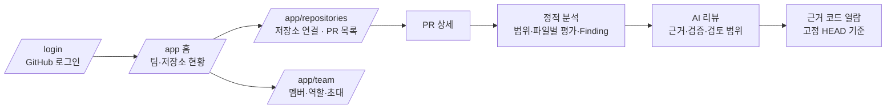

# PRism Frontend

> GitHub PR의 정적 분석 결과와 AI 리뷰를 한 화면에서 확인하는 Vue 3 웹 클라이언트입니다. **AI가 한 말이 어디서 나왔는지**(근거 줄·검토 범위·검증 결과)를 사용자가 직접 확인할 수 있게 만드는 데 집중했습니다.

Vue 3 · TypeScript · Vite · Vue Router · Vitest — 런타임 의존성은 `vue`와 `vue-router` 두 개뿐입니다(상태 관리·UI 라이브러리 없음).

| 저장소 | 역할 |
|---|---|
| [Prism-Backend](https://github.com/oso7865-ship-it/Prism-Backend) | API·분석 엔진·AI 리뷰 |
| **Prism-Frontend** (이 저장소) | 웹 클라이언트 |
| [Prism-Architecture](https://github.com/oso7865-ship-it/Prism-Architecture) | 설계 문서·ADR·작업 기록 |

## 화면 흐름



| 주소 | 역할 |
|---|---|
| `/login` | GitHub 로그인, 실패 안내와 재시도 |
| `/app` | 팀·저장소 현황 |
| `/app/repositories` | 저장소 연결(GitHub 허용 목록에서 선택), PR 동기화·검색·상세, 분석·AI 리뷰 |
| `/app/team` | 멤버·역할·초대 관리, 팀 문서(컨벤션) 관리 |

보호 페이지는 세션을 복원한 뒤에만 열리고, 비로그인·세션 만료 시 원래 가려던 주소를 기억한 채 로그인으로 보냅니다. OAuth·저장소 연결 callback은 결과 쿼리로 올바른 화면에 전달합니다.

## 구현 포인트

| 주제 | 내용 |
|---|---|
| **인증과 세션** | Access 토큰은 메모리에만 두고 Refresh는 HttpOnly 쿠키입니다. 만료 시 refresh를 **single-flight**로 합쳐 동시 요청이 여러 번 갱신하지 않게 했고, 로그아웃 실패·경쟁 상황을 테스트로 고정했습니다. 서버 비밀은 `VITE_*`에 넣지 않습니다. |
| **AI 결과를 있는 그대로 표현** | 지적을 "확정(SUPPORTED)"과 "확인 필요 질문(NEEDS_CONTEXT)"으로 분리해 보여주고, 검증 단계의 유지·수정·제거 집계, 수정안 사전 검사 결과, 검토 범위(어떤 파일을 읽었고 무엇을 제외했는지)를 함께 표시합니다. AI 실패를 "문제 없음"으로 그리지 않습니다. |
| **근거 코드 열람** | 지적의 근거 줄을 사이트 안에서 80줄 단위로 열어 확인합니다. 서버가 허용한 파일·줄만 요청하며 코드는 텍스트로만 렌더링합니다. |
| **HTML을 신뢰하지 않음** | 모델 출력·저장소 코드·팀 문서는 모두 `v-html` 없이 텍스트로 표시합니다. |
| **저장소 연결 선택 화면** | GitHub가 허용한 저장소를 소유자별로 묶어 보여주고 검색·보이는 항목 모두 선택·비활성 이유(권한 부족 등)·최대 20개 제한을 제공합니다. 만료·빈 목록·부분 실패·전체 성공 상태를 각각 설계했습니다. |
| **사용자 모드** | 시니어/주니어 설명 모드를 프로필에서 고르며, 리뷰는 요청 시점의 모드로 고정됩니다. |
| **반응형** | 375px 폭에서 가로 넘침 없이 동작하며 모바일은 PR 상세에 집중하고 목록으로 돌아올 수 있습니다. |

## 구조

```text
src/
  app/        라우터, 인증 후 공통 레이아웃, 로그인·홈
  features/   auth · workspace(저장소·PR·선택 화면) · analysis(분석·AI 리뷰) · standards(팀 문서)
  shared/     공통 API 클라이언트·표시 유틸·UI
```

API 응답 타입(`types.ts`)과 화면 표현 로직(`presentation.ts`, `reviewModel.ts`)을 컴포넌트에서 분리해, 표시 규칙을 컴포넌트 없이 단위 테스트할 수 있게 했습니다. 인증(`features/auth`)은 분석·팀 문서 화면이 공통으로 사용합니다.

## 검증

```bash
npm run typecheck   # vue-tsc
npm test            # vitest
npm run build
```

최근 기록: **vitest 156 passed**, 타입 검사·production build 통과. 테스트는 인증(refresh single-flight·만료 재시도·logout 경쟁), 라우트 접근 제어, 저장소 선택, 리뷰 근거·검토 범위·검증 표시, 소스 열람, 팀 문서 섹션, 배포 설정 검사를 다룹니다. CI는 build·test 외에 저장소 도구 테스트와 배포 스크립트 테스트를 실행하고, main에서는 테스트를 통과한 이미지를 GHCR에 게시해 EC2에 배포합니다.

## 로컬 실행

필요: Node 24, npm. 백엔드(`Prism-Backend`)와 PostgreSQL이 떠 있어야 로그인·데이터가 동작합니다.

```bash
git clone https://github.com/oso7865-ship-it/Prism-Frontend.git && cd Prism-Frontend
npm ci
npm run dev
```

**http://localhost:5173** 으로 접속합니다. OAuth callback과 쿠키 호스트를 맞추기 위해 `127.0.0.1`과 섞어 쓰지 않습니다. 개발 서버는 `/api`를 `http://127.0.0.1:8000`(백엔드)으로 프록시하며 `config/development.example`의 `API_PROXY_TARGET`으로 로컬 대상만 바꿀 수 있습니다. 하단의 연결 확인은 `/health/ready`를 호출하고, 실제 응답이 없으면 가짜 성공을 표시하지 않습니다.

운영에서는 `/app/*`, `/login` 직접 접근을 `index.html`로 처리하는 SPA fallback이 필요합니다(Caddy 설정 포함).

## 알려진 한계

- 리뷰 화면은 서버가 검증한 결과를 보여줄 뿐, AI 주장의 진실성을 화면이 보증하지 않습니다. 근거 열람은 사용자가 직접 판단하도록 돕는 장치입니다.
- 한 브라우저 탭 안에서의 refresh single-flight만 보장합니다(탭 간 조정은 없음).
- 허용 저장소가 300개를 넘으면 선택 목록에 일부만 보입니다(화면에 안내).
- 실제 키보드 전 구간 조작과 스크린 리더 검증은 수행하지 못했습니다.

## 더 읽기

[설계 문서 지도](https://github.com/oso7865-ship-it/Prism-Architecture/blob/main/docs/architecture/INDEX.md) · [프론트 설계](https://github.com/oso7865-ship-it/Prism-Architecture/blob/main/docs/architecture/frontend/README.md) · [배포 설계](https://github.com/oso7865-ship-it/Prism-Architecture/blob/main/docs/architecture/operations/DEPLOYMENT.md)
