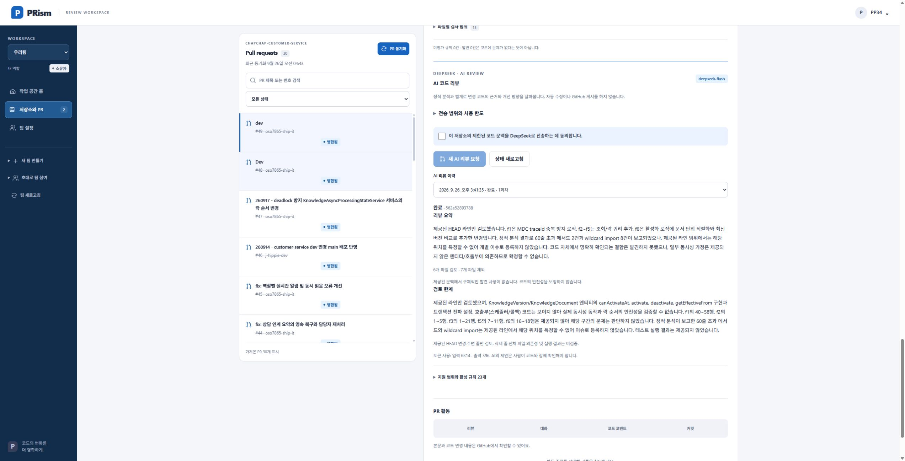
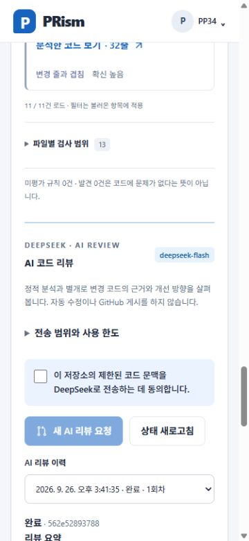

# 작업 리포트: AI 리뷰 화면

> 작업 브랜치: dev (과거 작업 시점; 원래 본문 범위 참조)
> 커밋/PR: 작성 당시 미커밋; 현재 게시 상태는 reports/_LATEST.md 참조
> 작업 범위: M
> 형식 상태: legacy
> 과거 적용 스킬 기록: 미확인 (이전 본문에 남은 적용 기록만 유효)
> 적용 Gate: 기존 본문 검증 범위 참조; 새 Gate 수행을 소급 주장하지 않음
> 위험도: 일반 (기록 형식 정정; 과거 작업 위험은 본문 참조)
> 형식 정정: 2026-09-26 게시 준비 중 누락 헤더 정리. 과거 검증을 재실행한 것으로 간주하지 않음.

> 작성일: 2026-09-26 · 상태 확인: 2026-09-26T15:46:46+09:00
> 브랜치: dev · 미커밋 · 병합/배포 미진행
> 구현/로컬 검증/실제 연동: PASS

## 0. 작업 범위 확인

완료된 정적 분석에 AIReviewPanel을 연결했다. OWNER 동의·수동 요청/취소·상태 폴링·이력·결과·사용량·실패 표시를 제공한다. 파란색 UI 체계를 사용하며 출력은 텍스트 렌더링한다. authClient는 오류 코드만 별도 전달하고 서버 원문 오류는 노출하지 않는다.

## 검증

typecheck/build PASS, Vitest35개 PASS. PR49 실제 DeepSeek 결과(6파일, 입력6314/출력396토큰)를 표시하고 새로고침 복원 확인. 320/375/414/768/1440px 가로 넘침 없음, 현재 console error/warn0. PR47은 크기 제한으로 외부 호출0이며 이에 대한 별도 오류 안내를 추가했다. 자동 재호출 없음.

## 증거

## 한계와 다음 작업

AI가 보지 못한 의존성/실행 결과는 검증되지 않는다. 실제 호출에서 발견0은 안전성 보장이 아니다. 구성원 읽기 권한/실행 제한은 서버가 강제한다. 배포와 하네스 동기화는 미진행. 서버 상세 검증 기록은 backend의 같은 날짜 ai-review Report를 따른다.
